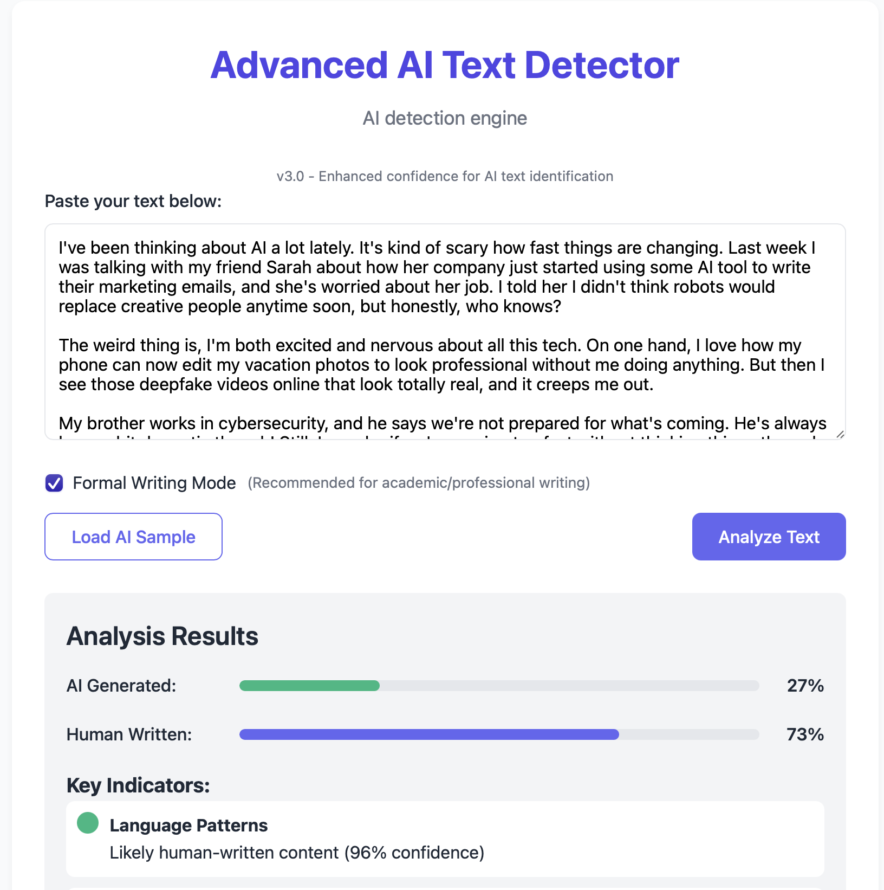

# Advanced AI Text Detector


A sophisticated web-based tool for detecting AI-generated content with high accuracy and detailed analysis.

## ✨ Features

- **AI Probability Analysis**: Calculates the likelihood that text was generated by AI vs. written by a human
- **Sentence-Level Analysis**: Highlights specific sentences with AI patterns and explains why
- **Three-Dimensional Evaluation**:
  - Language Patterns: Analyzes formal phrases, repeated patterns, and word predictability
  - Sentence Structures: Evaluates sentence length variation, complexity, and sentence beginnings
  - Vocabulary Usage: Assesses vocabulary diversity, word sophistication, and information density
- **Formal Writing Mode**: Specialized mode for analyzing academic and professional content with reduced false positives
- **Interactive Results**: Visual indicators and detailed explanations of detected patterns
- **Sample Text Examples**: Built-in samples of both AI and human writing for comparison

## 🖥️ Demo

[Live Demo](https://checkai.info)



## 🚀 Quick Start

### Local Setup

1. Clone the repository:
```bash
git clone https://github.com/your-username/ai-text-detector.git
cd ai-text-detector
```

2. Open index.html in your browser:
```bash
# Using a simple HTTP server with Python
python -m http.server 8000
# Then open http://localhost:8000 in your browser
```

### Deployment

This is a static website that can be hosted on any web hosting service:

- GitHub Pages
- Netlify
- Vercel
- Amazon S3
- Any traditional web hosting

## 🔍 How It Works

The detector employs sophisticated linguistic analysis techniques to identify patterns common in AI-generated text:

1. **N-gram Analysis**: Examines patterns in word sequences and repetition
2. **Sentence Structure Analysis**: 
   - Evaluates consistency in sentence length
   - Analyzes variance in complexity
   - Identifies patterns in how sentences begin
3. **Vocabulary Assessment**:
   - Measures word diversity and repetition
   - Analyzes sophistication of vocabulary
   - Assesses information density across sentences
4. **Contextual Pattern Recognition**:
   - Identifies formal transitional phrases
   - Detects template-like expressions
   - Recognizes predictable word choices
5. **Human Writing Indicators**:
   - Evaluates presence of contractions
   - Analyzes use of personal pronouns
   - Detects parenthetical expressions and asides

The algorithm combines these metrics with appropriate weights to generate an overall probability score, with special consideration for formal academic writing.

## 📊 Accuracy Considerations

- **Formal Writing**: Academic and professional content often shares some characteristics with AI writing (formal transitions, complex sentence structures). Use the "Formal Writing Mode" for these cases.
- **False Positives**: Some highly structured human writing may trigger AI indicators
- **Short Samples**: Texts under 100 words may not provide enough data for reliable analysis
- **Evolving AI**: As language models improve, detection patterns will need to be updated

## 🛠️ Customization

You can customize the detector by modifying the following:

- Adjust thresholds in the `analyzeText()` function to make detection more or less strict
- Modify the styling variables in the CSS section
- Add additional AI pattern phrases to the detection lists
- Change the sample texts for demonstration

## 📂 Project Structure

```
ai-text-detector/
├── index.html      # Main HTML file with embedded CSS and JavaScript
├── README.md       # Project documentation
└── assets/         # (Optional) Any additional assets like images
```

## 🤝 Contributing

Contributions are welcome! Please feel free to submit a Pull Request.

1. Fork the repository
2. Create your feature branch (`git checkout -b feature/amazing-feature`)
3. Commit your changes (`git commit -m 'Add some amazing feature'`)
4. Push to the branch (`git push origin feature/amazing-feature`)
5. Open a Pull Request

## 📝 License

This project is licensed under the MIT License - see the LICENSE file for details.

## 📚 References

- [Natural Language Processing Techniques](https://en.wikipedia.org/wiki/Natural_language_processing)
- [Statistical Language Models](https://en.wikipedia.org/wiki/Language_model)
- [Linguistic Analysis Methods](https://en.wikipedia.org/wiki/Linguistic_analysis)

---

Created with ❤️ by [Your Name](https://github.com/your-username)
